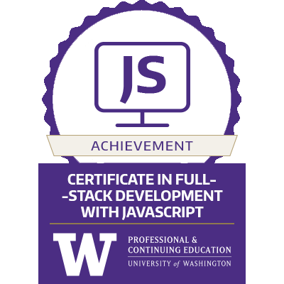

 

## Respositories

### API
[API Docs](https://github.com/tihsle/to-do-service-sp25)  
[API Docs Pages](https://tihsle.github.io/to-do-service-sp25/)  
[PromptCrafter API](https://github.com/tihsle/PromptCrafter)  

### Python

### JavaScript/React
[RevealLens](https://reveallens.vercel.app/)  
[RevealLens Code](https://github.com/tihsle/320-win25-finalproject-tihsle) 
[PromptCrafter API](https://github.com/tihsle/PromptCrafter)  

### Service Now
Company Vechicle Loaner App

### AWS Bedrock
AI Vector Search

<!--
**tihsle/tihsle** is a ✨ _special_ ✨ repository because its `README.md` (this file) appears on your GitHub profile.

Here are some ideas to get you started:

- 🔭 I’m currently working on ...
- 🌱 I’m currently learning ...
- 👯 I’m looking to collaborate on ...
- 🤔 I’m looking for help with ...
- 💬 Ask me about ...
- 📫 How to reach me: ...
- 😄 Pronouns: ...
- ⚡ Fun fact: ...
-->
